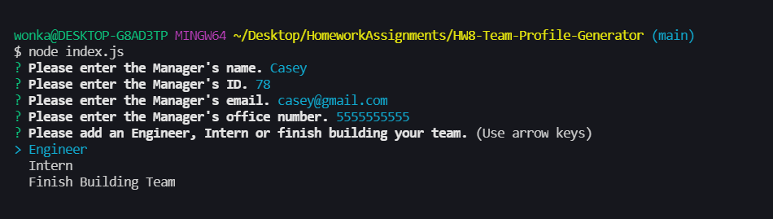
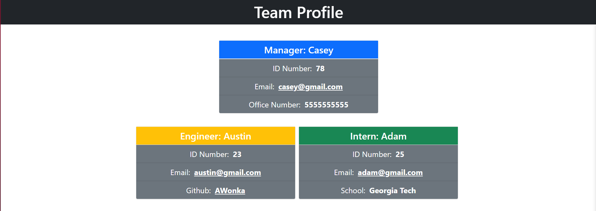

# HW8-Team-Profile-Generator

## Link to youtube video guide
This is the link to a video guide on how to use this Application:
https://www.youtube.com/watch?v=cjn-pFPOzHM

## Example Finished Generated Page

## How to use this Application
First you will start by opening the integrated terminal in the folder. Using node you will then type "node index.js" without the quotes. 

Once you have done this you then see the first prompt asking you to enter information on the Manager.

You will then see the remaining prompts for Manager information.**NOTE** You must enter valid information in each prompt or it won't let you proceed.

Once you enter all the Manager's information you will eventually see a prompt asking if you would like to add an Engineer, Intern, or Finish Building Your Team. If you select Engineer you will then be given similar prompts to the Manager but instead of Office Number you will add the Engineer's GitHub profile. If you select Intern you will be given similar prompts as well except for instead of Office Number you will be asked to add what School the intern attends/attended. If you select Finish Building Your Team it will generate the HTML file with the data you've entered so far.**NOTE** You may enter as many Engineer's and Intern's as you would like, they will all be generated in the HTML file.

When are you done filling out all of the employees you then need to select "Finish Building Your Team" the next time that prompt comes up. 

Once you select "Finish Building Your Team" you will notice it logs all of the information you filled out and generates the HTML in the following file location
/dist/index.html

## Finished Generated File
And after all of this you will see below that data is now generated in the HTML.
